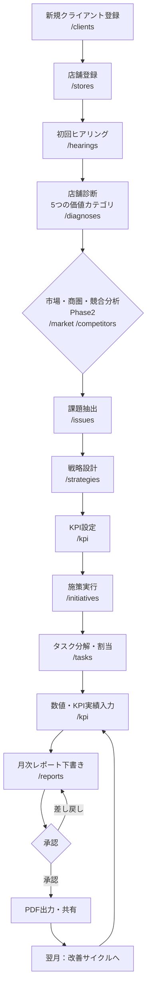

# ユーザー導線 — 飲食店マーケティングOS

本ドキュメントは、主要な業務フローとユーザー導線を定義する。

---

## 1. コアコンサルティングフロー（新規クライアントの立ち上げ）

マーケティング担当者が新規クライアントを受注してから、月次レポートで成果を報告するまでの中核フロー。

### 概要（矢印図）
```
新規クライアント登録
  → 店舗登録（クライアントに紐づけ）
    → 初回ヒアリング（事業概要・目標・現状の集客）
      → 店舗診断（5つの価値カテゴリでスコアリング）
        → 課題抽出（診断・分析から優先課題を特定）
          → 戦略設計（課題を解決する戦略を立案）
            → KPI設定（戦略の達成指標と目標値を定義）
              → 施策実行（KPI達成のための施策を登録）
                → タスク管理（施策を具体的な作業に分解）
                  → 月次レポート（KPI実績・施策結果を報告）
                    → （翌月へ）改善サイクルへ
```

### 各ステップの要点
1. **クライアント登録** (`/clients`): 企業情報・契約情報を登録。
2. **店舗登録** (`/stores`): 店舗をクライアントに紐づけて登録。以降の情報は店舗単位で管理。
3. **初回ヒアリング** (`/hearings`): テンプレートに沿って事業概要・ターゲット・現状・目標・予算を記録。
4. **店舗診断** (`/diagnoses`): 5つの価値カテゴリの診断項目をスコアリングし、強み・弱みを可視化。
5. **課題抽出** (`/issues`): 診断・分析結果から優先課題を登録し、優先度を設定。
6. **戦略設計** (`/strategies`): 各課題に対する戦略を立案し、課題と紐づけ。
7. **KPI設定** (`/kpi`): 戦略の達成度を測るKPIを定義し、目標値を設定。
8. **施策実行** (`/initiatives`): KPI達成に向けた施策を登録し、戦略・KPIと紐づけ。
9. **タスク管理** (`/tasks`): 施策を実行可能な作業に分解し、担当・期限を割り当て。
10. **月次レポート** (`/reports`): KPI実績と施策結果を集約し、下書き生成 → 編集 → 承認 → 共有。

### Mermaid フローチャート


---

## 2. 日次業務フロー

担当者が毎日ログインして、対応すべき事項を確認・処理する導線。

### 矢印図
```
ログイン (/login)
  → ダッシュボード (/dashboard)
    → 注意店舗の確認（KPI未達・診断未実施など）
    → 期限超過／当日期限タスクの確認
      → 該当店舗／タスクへ遷移して対応
        → タスク更新・KPI入力・施策更新
          → ダッシュボードへ戻り残件確認
```

### 要点
- ダッシュボードは「今日やるべきこと」を集約する。注意店舗カード、期限超過タスクリスト、KPI進捗、承認待ちレポートを1画面で提示する。
- 各カードから対象の詳細画面へワンクリックで遷移できる。
- 対応後はステータス更新により、ダッシュボードの残件が自動的に減る。

---

## 3. 月次業務フロー（レポート作成）

月初〜月次締めにかけて、前月実績を集計しレポートを作成・承認・共有する導線。

### 矢印図
```
KPI実績入力 (/kpi)  ── 各店舗の前月数値を入力
  → 月次レポート下書き自動生成 (/reports)
      ・KPI実績（目標対比）を自動取り込み
      ・施策の実行結果を自動取り込み
      ・（Phase3）AIによるコメント下書き生成
  → 担当者が編集（考察・次月アクションを追記）
    → 管理者へ承認申請
      → 承認 or 差し戻し
        → 承認後：PDF出力
          → クライアントへ共有（Phase3で自動送信）
```

### 要点
- レポートは手作業をゼロにするのではなく「下書きの自動生成 → 人が編集 → 承認」を基本とする。
- 承認フローにより品質を担保する。差し戻し時はコメントを添える。
- AI生成物（Phase 3）は必ず人が編集・承認してから確定・共有する（Human-in-the-loop）。

---

## 4. 権限による導線の差異
- **管理者(admin)**: 全画面・全データにアクセス可能。ユーザー管理・テンプレート管理・レポート承認を担う。
- **マーケティング担当者(marketer)**: 担当クライアント・店舗の作成・編集、レポート下書き作成を担う。承認は管理者に依頼。
- **クライアント(client, Phase 3)**: 自社に関する診断結果・KPI・月次レポートの閲覧に限定。
