# ER設計 — 飲食店マーケティングOS

本ドキュメントは、データモデル（ER図）とマルチテナント戦略、診断スコアリングモデルを定義する。

## 0. 共通カラム規約
すべてのテーブルは以下の共通カラムを持つ。

| カラム | 型 | 説明 |
| --- | --- | --- |
| `id` | uuid (PK) | 主キー |
| `organization_id` | uuid (FK) | テナント（組織）識別子。`organizations` を参照。 |
| `created_at` | timestamptz | 作成日時 |
| `updated_at` | timestamptz | 更新日時 |
| `created_by` | uuid (FK→users) | 作成者 |
| `updated_by` | uuid (FK→users) | 更新者 |
| `deleted_at` | timestamptz nullable | 論理削除日時（論理削除対象テーブルのみ）。NULL=有効。 |

※ `organizations` 自身は `organization_id` を持たず（テナントルート）、`users` は `organization_id` を持つが `created_by/updated_by` は自己参照になり得る点に注意。

---

## 1. ER図（Mermaid）

```mermaid
erDiagram
    organizations ||--o{ users : "has"
    organizations ||--o{ clients : "has"
    organizations ||--o{ stores : "has"

    users ||--o{ client_members : "assigned"
    clients ||--o{ client_members : "has"
    clients ||--o{ stores : "owns"
    clients ||--o{ contracts : "has"

    stores ||--o{ hearings : "has"
    stores ||--o{ diagnoses : "has"
    stores ||--o{ market_analyses : "has"
    stores ||--o{ trade_area_analyses : "has"
    stores ||--o{ competitors : "tracks"
    stores ||--o{ demand_analyses : "has"
    stores ||--o{ supply_analyses : "has"
    stores ||--o{ issues : "has"
    stores ||--o{ strategies : "has"
    stores ||--o{ kpi_definitions : "has"
    stores ||--o{ initiatives : "has"
    stores ||--o{ social_contents : "has"
    stores ||--o{ tasks : "has"
    stores ||--o{ meetings : "has"
    stores ||--o{ monthly_reports : "has"
    stores ||--o{ files : "has"

    diagnosis_categories ||--o{ diagnosis_items : "contains"
    diagnoses ||--o{ diagnosis_scores : "produces"
    diagnosis_items ||--o{ diagnosis_scores : "scored_as"

    issues ||--o{ strategies : "addressed_by"
    strategies ||--o{ kpi_definitions : "measured_by"
    strategies ||--o{ initiatives : "realized_by"
    kpi_definitions ||--o{ kpi_records : "tracked_as"
    kpi_definitions ||--o{ initiatives : "targeted_by"
    initiatives ||--o{ social_contents : "produces"
    initiatives ||--o{ tasks : "broken_into"

    tasks ||--o{ task_comments : "has"
    meetings ||--o{ meeting_actions : "has"

    knowledge_cases }o--o| stores : "referenced_from"
    activity_logs }o--|| users : "actor"

    organizations {
        uuid id PK
        string name
        string plan
        timestamptz created_at
        timestamptz updated_at
    }
    users {
        uuid id PK
        uuid organization_id FK
        string email
        string name
        string role "admin|marketer|client"
        timestamptz deleted_at
    }
    clients {
        uuid id PK
        uuid organization_id FK
        string name
        string industry
        string status "lead|active|churned"
        timestamptz deleted_at
    }
    stores {
        uuid id PK
        uuid organization_id FK
        uuid client_id FK
        string name
        string address
        string genre
        string status "active|attention|inactive"
        timestamptz deleted_at
    }
    contracts {
        uuid id PK
        uuid organization_id FK
        uuid client_id FK
        string plan
        int monthly_amount
        date start_date
        date end_date
        string status
        timestamptz deleted_at
    }
    client_members {
        uuid id PK
        uuid organization_id FK
        uuid client_id FK
        uuid user_id FK
        string role_in_client
    }
    hearings {
        uuid id PK
        uuid organization_id FK
        uuid store_id FK
        jsonb answers
        date hearing_date
        timestamptz deleted_at
    }
    diagnoses {
        uuid id PK
        uuid organization_id FK
        uuid store_id FK
        date diagnosed_at
        string summary
        int total_score
        timestamptz deleted_at
    }
    diagnosis_categories {
        uuid id PK
        uuid organization_id FK
        string name "5つの価値"
        int display_order
        int weight
        timestamptz deleted_at
    }
    diagnosis_items {
        uuid id PK
        uuid organization_id FK
        uuid category_id FK
        string label
        string description
        int max_score
        int display_order
        timestamptz deleted_at
    }
    diagnosis_scores {
        uuid id PK
        uuid organization_id FK
        uuid diagnosis_id FK
        uuid item_id FK
        int score
        string comment
    }
    market_analyses {
        uuid id PK
        uuid organization_id FK
        uuid store_id FK
        jsonb data
        timestamptz deleted_at
    }
    trade_area_analyses {
        uuid id PK
        uuid organization_id FK
        uuid store_id FK
        jsonb data
        timestamptz deleted_at
    }
    competitors {
        uuid id PK
        uuid organization_id FK
        uuid store_id FK
        string name
        string price_range
        jsonb strengths_weaknesses
        timestamptz deleted_at
    }
    demand_analyses {
        uuid id PK
        uuid organization_id FK
        uuid store_id FK
        jsonb data
        timestamptz deleted_at
    }
    supply_analyses {
        uuid id PK
        uuid organization_id FK
        uuid store_id FK
        jsonb data
        timestamptz deleted_at
    }
    issues {
        uuid id PK
        uuid organization_id FK
        uuid store_id FK
        uuid diagnosis_id FK
        string title
        string priority
        int impact
        timestamptz deleted_at
    }
    strategies {
        uuid id PK
        uuid organization_id FK
        uuid store_id FK
        uuid issue_id FK
        string title
        string concept
        timestamptz deleted_at
    }
    kpi_definitions {
        uuid id PK
        uuid organization_id FK
        uuid store_id FK
        uuid strategy_id FK
        string name
        string unit
        numeric target_value
        timestamptz deleted_at
    }
    kpi_records {
        uuid id PK
        uuid organization_id FK
        uuid kpi_definition_id FK
        date period_month
        numeric actual_value
    }
    initiatives {
        uuid id PK
        uuid organization_id FK
        uuid store_id FK
        uuid strategy_id FK
        uuid kpi_definition_id FK
        string channel "SNS|MEO|Ad|LINE|Other"
        string status
        timestamptz deleted_at
    }
    social_contents {
        uuid id PK
        uuid organization_id FK
        uuid store_id FK
        uuid initiative_id FK
        string channel
        string status "draft|scheduled|posted"
        timestamptz scheduled_at
        timestamptz deleted_at
    }
    tasks {
        uuid id PK
        uuid organization_id FK
        uuid store_id FK
        uuid initiative_id FK
        uuid assignee_id FK
        string title
        string status
        date due_date
        timestamptz deleted_at
    }
    task_comments {
        uuid id PK
        uuid organization_id FK
        uuid task_id FK
        string body
    }
    meetings {
        uuid id PK
        uuid organization_id FK
        uuid store_id FK
        date meeting_date
        string minutes
        timestamptz deleted_at
    }
    meeting_actions {
        uuid id PK
        uuid organization_id FK
        uuid meeting_id FK
        string title
        uuid assignee_id FK
        string status
    }
    monthly_reports {
        uuid id PK
        uuid organization_id FK
        uuid store_id FK
        date report_month
        string status "draft|review|approved"
        jsonb content
        timestamptz deleted_at
    }
    knowledge_cases {
        uuid id PK
        uuid organization_id FK
        uuid store_id FK
        string title
        string outcome "success|failure"
        jsonb tags
        timestamptz deleted_at
    }
    files {
        uuid id PK
        uuid organization_id FK
        uuid store_id FK
        string entity_type
        uuid entity_id
        string storage_path
        string mime_type
        int size_bytes
        timestamptz deleted_at
    }
    activity_logs {
        uuid id PK
        uuid organization_id FK
        uuid user_id FK
        string action
        string entity_type
        uuid entity_id
        jsonb diff
        timestamptz created_at
    }
```



---

## 2. マルチテナント戦略

### 2.1 テナントルート
- `organizations` がテナントの最上位（ルート）である。1組織 = 1マーケティング会社。
- 他の全テーブルは `organization_id` を保持し、必ずいずれかの組織に属する。

### 2.2 分離方式：単一DB・共有スキーマ + RLS
- 単一データベース・共有スキーマ方式を採用し、行レベルで組織を分離する。
- **Supabase RLS（Row Level Security）** を全テーブルで有効化し、`organization_id = auth.jwt() ->> 'organization_id'`（またはユーザー所属組織）に一致する行のみアクセス可能とする。
- アプリ層でも全クエリに `organization_id` 条件を付与し、DB層（RLS）と二重で防御する（Defense in Depth）。
- `created_by / updated_by` により監査可能性を確保し、`activity_logs` に重要操作を記録する。

### 2.3 ロールによる追加制御
- `admin`: 自組織の全行にアクセス可。
- `marketer`: 自組織の行のうち、担当（`client_members`）に紐づくデータを中心にアクセス。
- `client`（Phase 3）: `client_members` を通じて紐づく `client` 配下の、共有許可された行のみ閲覧可。

### 2.4 論理削除
- `deleted_at` を持つテーブルは物理削除しない。一覧・参照系のクエリは常に `deleted_at IS NULL` を条件に含める。
- `kpi_records`, `diagnosis_scores`, `task_comments`, `client_members`, `meeting_actions`, `activity_logs` など明細・ログ系は原則物理削除せず親に追従、または保持する（設計上 `deleted_at` を省略）。

---

## 3. 診断スコアリングモデル（5つの価値）

診断は「カテゴリ → 項目 → スコア」の3層構造でモデル化する。

```
diagnosis_categories（5つの価値カテゴリ）
    例：商品・メニュー価値 / 接客・サービス価値 / 空間・雰囲気価値 /
        ブランド・情報発信価値 / 価格・コスパ価値
        ├─ weight（カテゴリ重み）, display_order
        │
        └─ diagnosis_items（各カテゴリに属する診断項目）
               例：「看板メニューの魅力」「盛り付け・見栄え」...
               ├─ max_score（満点）, display_order
               │
               └─ diagnosis_scores（1回の診断における各項目の採点）
                      ├─ diagnosis_id（どの診断か）
                      ├─ item_id（どの項目か）
                      ├─ score（点数）, comment（所見）
```

### モデルの要点
- **可変性**: `diagnosis_categories` と `diagnosis_items` は組織ごとにテンプレートとして編集可能（`/templates`）。項目追加・並び替え・重み変更に対応する。
- **1診断 = 複数スコア**: `diagnoses` 1件に対し、各 `diagnosis_items` ごとの `diagnosis_scores` が紐づく。項目数が増えても行が増えるだけで済むよう縦持ち（EAV的）で保持する。
- **集計**: カテゴリスコア = 配下項目スコアの合計（または加重平均）。総合スコア（`diagnoses.total_score`）= カテゴリスコアを `weight` で加重集計。
- **可視化**: カテゴリ単位のスコアをレーダーチャート（Recharts）で表示し、5つの価値バランスを一目で把握する。
- **時系列比較**: 同一店舗の複数 `diagnoses` を比較し、改善推移を追える。
